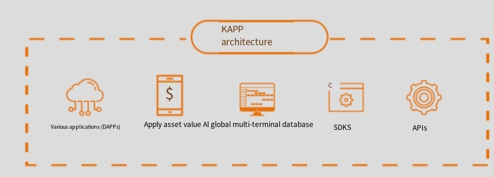
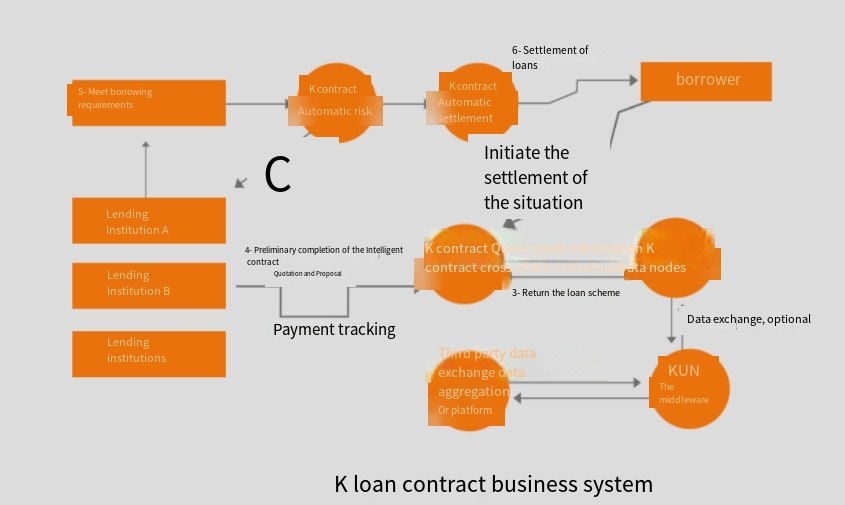
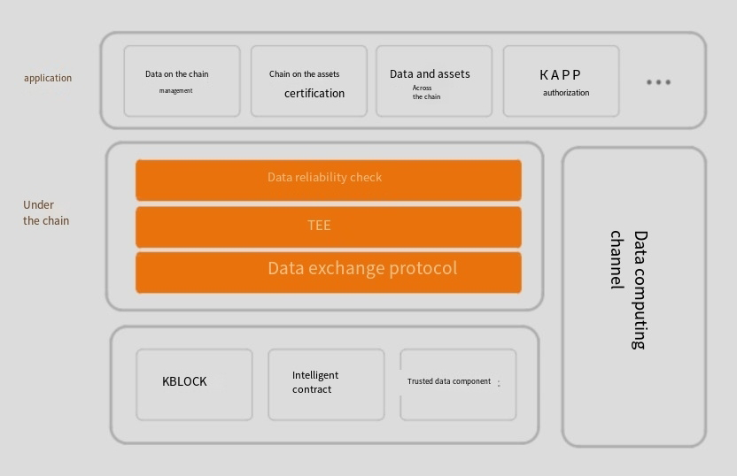
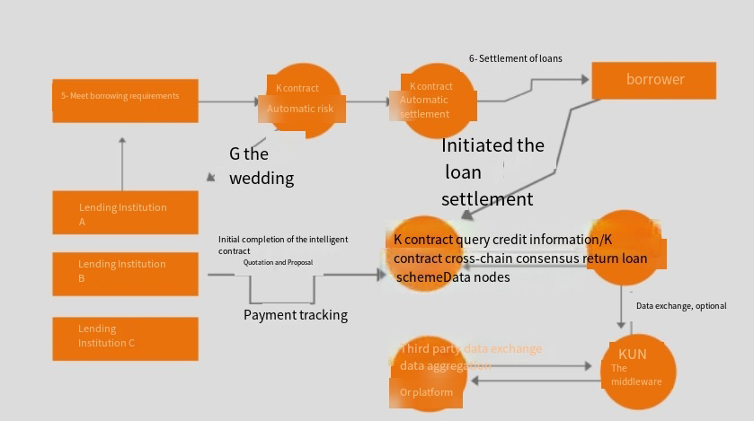
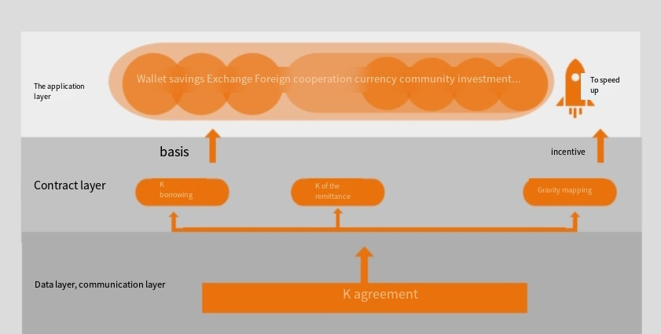
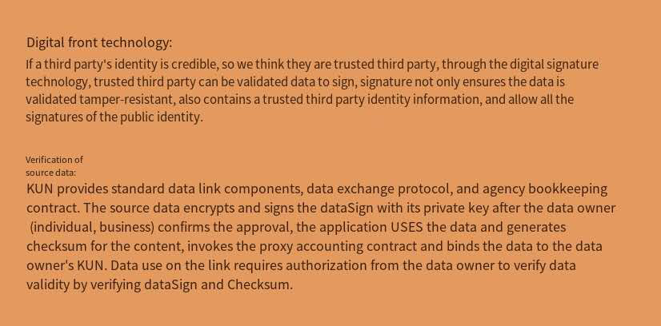

# Technical architecture

The underlying architecture of Kun will provide a complete DAPP framework system and blockchain system

### DAPP framework system:

Kun provides DAPP application development components and SDK to simplify DAPP development. The combined toolkit does not need to focus on business and scenario development

People are familiar with the underlying technology of blockchain. In addition, the Kun network provides a database of distributed trusted data / assets for the promotion of the interactive use of distributed communities

And value cross-border circulation provides a platform to further support the realization of various upper level applications.

### Blockchain system:

It includes pure asset technology, intelligent contract system, security system, storage system and cross chain system. Meanwhile, it also analyzes the underlying complex technology system and heterogeneous technology system

The system is integrated to support distributed entity management and multi-dimensional authentication protocols compatible with various major protocols and cryptographic standards

Cross chain and cross system interactive mapping between quasi heterogeneous blockchain and traditional information. It also provides secure data storage, heterogeneous smart contract and hardware key tube

Management, encryption data analysis and other technical systems.  

### Cross chain technology

Cross chain communication protocol is the core protocol of Kun, which plays an important role in communication bridge and completes the important mission of cross chain technology upgrading

With the support of large cross chain contracts, Kun can make continuous efforts in the field of taking finance as the commanding height. And all the service nodes and autonomous communities constitute one

A complete Internet system.

  

### K communication protocol

K communication protocol is the basic communication protocol of cross link technology. It is a bridge between different chains

Ground p2s light node can quickly obtain the communication authority of the nearest node in the service chain. Through the one-way encryption of data, it forms a unique communication on the cross chain

Communication node. When this node obtains the communication node from another chain that has undergone one-way encryption for matching, it returns the transaction table

Information. Then activate the cross chain accounts in different public chains to complete the transaction.

### K remittance contract

As the technical support of cross chain contract layer, K remittance contract is the underlying intelligent contract for constructing kunc end service, which follows the cross chain atomic transaction and service

In the principle, the bottom layer of acct adopts cosmos core cross chain code, and constructs chain to atom with cosmos zone and cosmos hub

Trading channels, such as BTC chain BTC zone hub eth zone eth chain. It can realize the integration of large amount of mainstream digital certificates

Decentralized matchmaking. Assuming that Indian workers to the United States want to remit money back to China, they only need to remit usdt to the OTC service provider designated by Kun

At this time, some people in India want to use Kun to buy some eth, so Kun uses the matching system of acct to complete BTC

Then eth is sold to the local OTC service provider in India, and Kun is remitted to the designated account.

K-remittance agreement is an attempt by Kun to solve the high cost of cross-border remittance in the physical world by using the global liquidity of digital token. whole

The process is transparent to users, and users only feel that the French currency is in and out. The service charge consists of OTC service and currency transaction service,

Moreover, with the good liquidity of OTC and currency transactions, the remittance cycle can be shortened to the day of remittance.

### K loan contract

As the second largest contract layer technical support, k-loan contract mainly guarantees the realization of revenue self-reliance through the contract layer

Move transfer, at the same time to ensure the safety of funds; no need to collect, automatic closing position. Loan business is one of the most common business in traditional finance, which can be effective

We should enhance the value liquidity, enlarge the capital leverage, and earn considerable interest margin income.  

# Gravitational mapping

K communication protocol is a kind of marriage chain encryption communication protocol. Its feature is to ensure the security of information while ensuring cross chain transactions. This is accomplished through decentralized data mapping, but how

To ensure the close relationship between decentralized autonomous communities, Kun's solution is gravity mapping, and realizes the gravitational region and gravity enhancement

### Gravitational mapping

Gravitational mapping is divided into two abilities: gravity and mapping. Gravity is an invisible force, and mapping is an intangible one. In K potential theory, weak relation and strong relation are realized by encryption algorithm

At the same time, through decentralized mapping, transaction data and information data can be displayed in the language line where users need to log in, and can not be chased by the third party  

### Active mapping and passive mapping

In the transaction relationship, the most sensitive information is who is the trader and who is the respondent. The transaction mapping relationship created by Kun can protect the transaction between both parties

At the same time of privacy and security, the relationship is distinguished and bound in the form of K contract. The revenue is passively mapped by K contract

To the corresponding account. Users can also complete active mapping in a secure trading environment. For example, there is a hierarchical relationship between a and B, and this layer

Level relationship can not be proved by the outside world, but Kun completes the relationship binding between them through the gravitational mapping in K protocol. Because of the relationship between AB and ab

There is a hierarchical relationship, the distribution of interests occurs through the K contract, a passively obtains income, at this time, the phenomenon of a's account is passive

Mapping. When a has a direct transaction with B and a proposes an incentive to B, B chooses to accept it. At this time, under the condition of data security, B's account sends

In this case, the behavior between AB and ab is called active mapping.  

### Rtxp open source protocol

Kun adopts a blockchain P2P network based on rtxp open source protocol, which enables users to conduct point-to-point digital token transactions and instant settlement

It's as easy and easy to convert trading assets (traditional currency, electronic currency and other forms of assets) as simple as sending an email

Single, greatly reducing the risk and handling charges in the process of inter-bank transfer, especially in the process of international transfer.

Different from the centralized network mode, each node in kunp2p network has equal computer status, and each node has the same network power

Centralized server. All nodes share part of computing resources, software or information content through specific software protocols. P2P network technology

It is one of the core technologies of Kun technology architecture.

Rtxp protocol and the traditional bank swift wire transfer agreement comparison: through the traditional bank swift transfer will be charged a high fee and time-consuming

In three to five days, the service charge for cross-border transfer and payment with rtxp is almost zero, and it is real-time arrival.  

# Secure data sharing  

### Kun universal digital identity

The general digital identity of Kun will be the passport of the blockchain world. It will open up all applications on the alliance chain and make the ecological world established by Kun smooth

No obstruction. Behind the digital identity are the ownership of assets, personal information, personal background, credit history and social relations, which are related to money

It also needs strong trust.

  

### Kun data link up

Blockchain, as a distributed and non tamperable trusted account book, provides a good means of value storage. However, blockchain technology itself only provides chain

The process of data from the chain down to the chain is ignored because of the unforgeability of the data. How to ensure the credibility of this process is the Kun trusted data component

One of the important issues to study and solve.

When we discuss the credibility of the data itself, we will think of some trusted verifiers, such as personal identity verification in China

Card, we may use the public security provided two elements (name + ID card number) authentication interface; or our bank card information, we need to pass the

The interface of the bank. Therefore, we realize that centralized trust institutions such as banks and public security organs are irreplaceable to some extent

The emergence of blockchain technology is not to subvert such a trust mechanism, but to supplement such a mechanism with a more secure and efficient solution

Case:

  

### Kun data stored procedure

Kun adopts double-layer data storage, in which the hot backup model of HA is adopted for relational database, which is stored together by master and slave nodes

Storage, automatic real-time synchronization, so as to ensure the security of relational data. It also introduces shardinggroup as the main query interface

Enter the index mechanism to speed up the query. The non relational database is stored in IPFs mode, and the two-tier data storage model is established,

It effectively improves the efficiency of data query, and greatly improves the work efficiency under the condition of ensuring the quality of data. In relational databases and non relational databases

In this paper, the advantages and disadvantages of the database are discussed, and the optimal combination of the two is achieved.